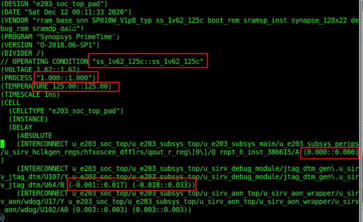
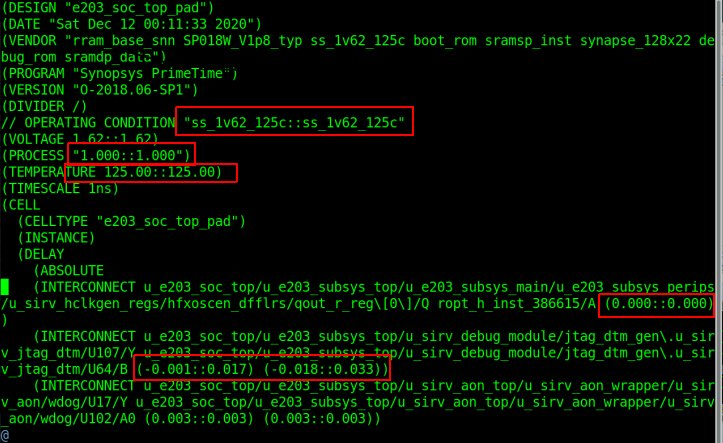
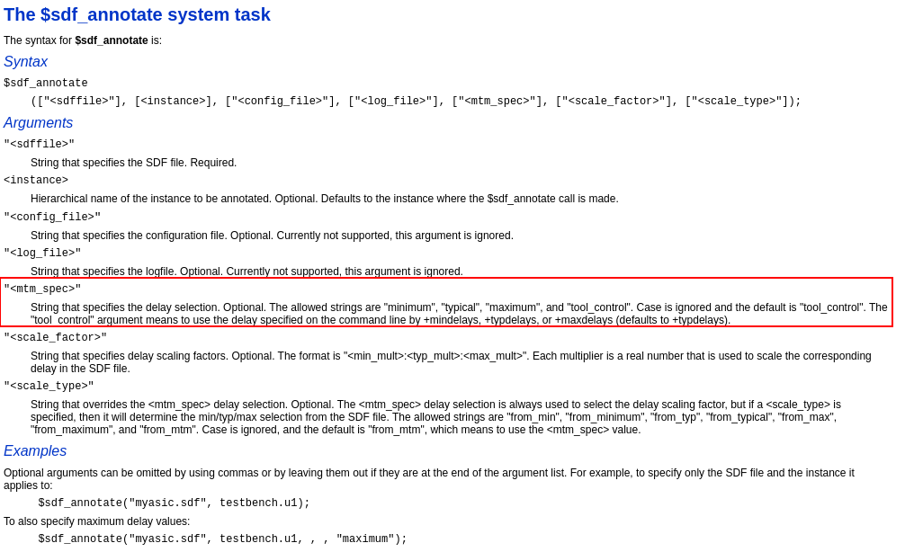
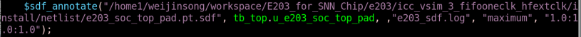

# 67组之江小组每周工作记录

<!-- 这是一个记录小组每周工作的仓库。 -->
<!--  -->
<!-- 它有时快乐，有时忧郁，有时紧张，有时轻松。 -->
<!--  -->
<!-- 除了默默记录，它也笑着点赞，它也皱着眉说可以。 -->
<!--  -->
<!-- 它是一是条湾湾的河，载这大家的期待奔向大海。 -->
<!--  -->
<!-- 它永远相信美好的事情即将发生。 -->

---
## 2020-12-18
#### 魏劲松
--- **本周工作**
1. 解决数字后仿过反标的问题。
> 数字后仿需要pt导出sdf文件反标到std_cell中。 
但是在PT导出的sdf文件的反标格式是(min::max). 而verilog的系统函数$sdf_annotate()中默认的反标格式是(min::typ::max)。如果我们在反标的时候选择typ类型(默认是typ)，那么反标就会失败。 
###### PT sdf Type
<!--   -->
 
###### $sdf_annotate说明
 
###### 在verilog中正确的写法
由于在pt导出的sdf文件中没有typ类型的延时所以sdf_annotate只能选择"MINIUM"和“MAXIUM”类型。写法如下
 

---
## 2020-12-11
### 工作汇报

#### 魏劲松
---
**本周工作**

1. 查找网表的bug
    1. dma模块中有一个寄存器没有在reset时赋初值
    2. router中的一个always模块中的条件太复杂，导致dc在给clkgate的enable是一个复杂逻辑且和fifo的输出有关系。因为fifo的输出问题。
2. 查找后仿的问题
    1. lfextclk和hfextclk这两个时钟有关联，但是在dc的script中家了fasepath
    2. 目前的电路跑不到50MHz，只能跑10MHz。但是综合的结果显示可以跑到50MHz。目前没有找到原因
3. 整理DC流程
- [ dc 流程整理[DC]](./member/weijinsong/T20201212/dc.md)
4. 整理一个SNN文献分享的仓库

[chips for spiking Neural Network](https://gitee.com/weijinsong/chips-for-spiking-neural-network#neuron-circuits)

**本周问题**
---

# History
 - [2020](history/2020)
   - [09](history/2020/2020_09.md)
   - [10](history/2020/2020_10.md)
   - [11](history/2020/2020_11.md)
