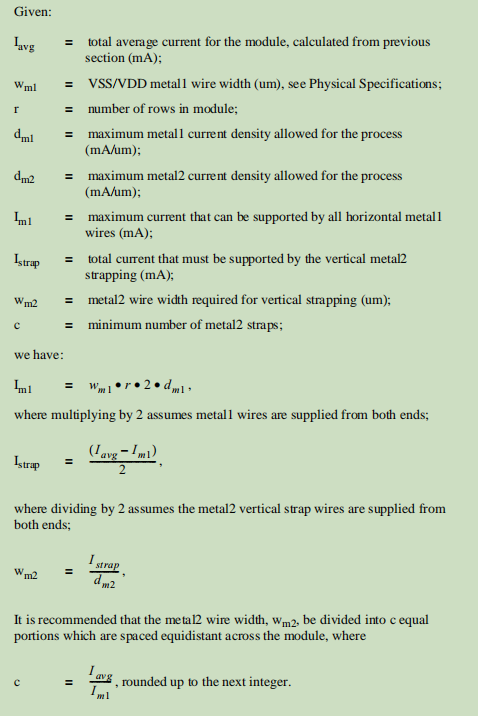

## 2020-11-12
### 工作汇报

#### 魏劲松
---
**本周工作**
>1. 数字后端设计需要先知道模拟电路的形状，大小，和pin的位置，所以我先写了一个假的lef文件。目前给模拟电路估计的大小是:[5.5um * 5.5um].

>2. 确定clk-gate类型。clk-gate一般有三种类型: a.简单组合逻辑实现; b.锁存器实现; c.D-触发器实现;
>> a. 简单组合逻辑实现
```verilog
    assign clk_out = clk_in & en;
```
>> b. 锁存器实现
```verilog
reg enb;
always @(*)
begin
    if (~clk_in) begin
        enb <= en;
    end
end
assign clk_out = enb & clk_in;
```
>> c. D-触发器实现
```verilog
reg enb ;
always @(posedge clk_in)
begin
    enb <= en;
end
assign clk_out = enb & clk_in;
```
>>确定了clk-gate类型后，可以直接例化上述模块。

>3. 确定Power Grid
>> a. 根据电流密度上限确定纵向电源线的宽度和数量"smic18m.pdf|p22";
<br>
>> b. 根据ir drop确定纵向和横向电源线的宽度和数量;<br>
>> Metal1的线宽是固定的在"smic18m.pdf|p12"中可以查到;


>> Metal1-M6的电流密度,Metal1-Metal6, Via1-Via5的电阻可以在smic180的designrule中查到;
>> DesignRule在TF文件中的“TD-LO18-DR-2001v10.0.zip"中。(p128, p13-p14)

>> 只要Power Grid同时满足上述两条就可以了。

>> 我们的设计
>>> 数字部分:宽度2um 横竖个50条

>>> 模拟部分:宽度2um 每个核心横竖个2两条，整个芯片横竖个16条
